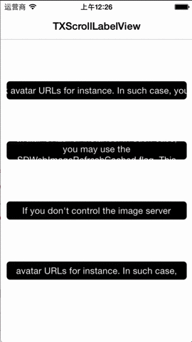

# TXScrollLabelView

      

`TXScrollLabelView` is an iOS class that displays a adverts or boardcast e.g. with an view.

## Support what kinds of scrollType

- **TXScrollLabelViewTypeLeftRight** : scrolling from right to left, and cycle all contents(`scrollTitle`) in a single line.

- **TXScrollLabelViewTypeUpDown**: scrolling from bottom to top, and cycle all contents.

- **TXScrollLabelViewTypeFlipRepeat**: scrolling from bottom to top, and cycle the first line of your contents.

- **TXScrollLabelViewTypeFlipNoRepeat**: scrolling from bottom to top, and cycle all contents with a line once times.

And `scrollVelocity` property now supports all above enum of `TXScrollLabelViewType`, just enjoy it!

## Usage 

**Objective-C example :**

        NSString *scrollTitle = @"xxxxxx";
        //options 是 TXScrollLabelViewType 枚举类型， 此处仅为了方便举例
        TXScrollLabelView *scrollLabelView = [TXScrollLabelView scrollWithTitle:scrollTitle type:options velocity:3 options:UIViewAnimationOptionTransitionFlipFromTop];
        [self.view addSubview:scrollLabelView];
        
        //布局(Required)
        scrollLabelView.frame = CGRectMake(50, 100 * (options + 0.7), 300, 30);
        
        //偏好(Optional)
        scrollLabelView.tx_centerX  = [UIScreen mainScreen].bounds.size.width * 0.5;
        scrollLabelView.scrollInset = UIEdgeInsetsMake(0, 10 , 0, 10);
        scrollLabelView.scrollSpace = 10;
        scrollLabelView.font = [UIFont systemFontOfSize:15];
        scrollLabelView.textAlignment = NSTextAlignmentCenter;
        scrollLabelView.backgroundColor = [UIColor blackColor];
        scrollLabelView.layer.cornerRadius = 5;
        
        //开始滚动
        [scrollLabelView beginScrolling];
        self.scrollLabelView = scrollLabelView;
        
        
You can running **TXScrollLabelViewDemo** for more details.

**Swift example :** Producting.

## License

`TXScrollLabelView` is available under the MIT license. See the LICENSE file for more info.

